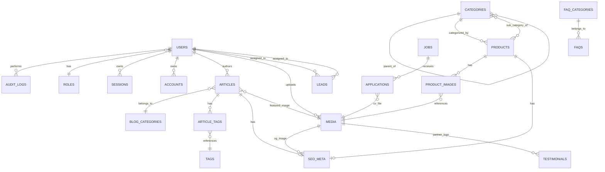

# ERD — HuCha Indonesia

Source of truth: `docs/HuCha_Indonesia_Master_Blueprint.md` §15 (ERD textual/mermaid). This diagram extends the blueprint with the Better Auth tables (`sessions`, `accounts`, `verifications`) added in Phase 0.

## Mermaid

## Textual Entity List

### Auth (Better Auth adapter)

- `users` — id, name, email (unique), email_verified, image, password_hash (nullable), role_id (FK), is_active, last_login_at, created_at, updated_at
- `sessions` — id, expires_at, token (unique), created_at, updated_at, ip_address, user_agent, user_id (FK)
- `accounts` — id, account_id, provider_id, user_id (FK), access_token, refresh_token, id_token, access_token_expires_at, refresh_token_expires_at, scope, password, created_at, updated_at
- `verifications` — id, identifier, value, expires_at, created_at, updated_at

### Commerce-Adjacent Content

- `categories` — id, name, slug (unique), type (spareparts/fluids/autocare), parent_id (self FK)
- `products` — id, name, slug (unique), category_id (FK), sub_category_id (FK), short_description, description, tokopedia_url, shopee_url, tiktokshop_url, is_featured, status, deleted_at
- `product_images` — id, product_id (FK), media_id (FK), sort_order
- `media` — id, file_name, file_path, mime_type, size_bytes, alt_text, width, height, uploaded_by (FK), created_at

### Editorial Content

- `blog_categories` — id, name, slug (unique)
- `tags` — id, name, slug (unique)
- `articles` — id, title, slug (unique), blog_category_id (FK), featured_media_id (FK), excerpt, body, status, published_at, author_id (FK), deleted_at
- `article_tags` — (article_id FK, tag_id FK) composite PK
- `seo_meta` — id, entity_type, entity_id, meta_title, meta_description, slug_override, og_image_media_id (FK), canonical_url

### Lead-Generating

- `leads` — id, type (distributor/oem/contact/career_note), full_name, company_name, region, whatsapp, email, message, category_of_interest, status, assigned_to (FK), source_page, created_at
- `jobs` — id, title, slug (unique), department, location, employment_type, description, requirements, status, deleted_at
- `applications` — id, job_id (FK), full_name, email, phone, cv_media_id (FK), cover_note, status, created_at

### Operational / CMS

- `testimonials` — id, partner_name, partner_business, quote, partner_logo_media_id (FK), rating, is_published, deleted_at
- `faq_categories` — id, name, slug (unique)
- `faqs` — id, faq_category_id (FK), question, answer, sort_order, is_published
- `audit_logs` — id, user_id (FK), action, entity_type, entity_id, meta (JSONB), created_at
- `analytics_snapshots` — id, date (unique), unique_visitors, page_views, top_articles (JSONB), new_leads_count
- `settings` — key (PK), value (JSONB)

## Cardinality & FK Rules

| From           | To                  | Cardinality          | On Delete            |
| -------------- | ------------------- | -------------------- | -------------------- |
| users          | roles               | N:1                  | role: SET NULL       |
| users          | sessions/accounts   | 1:N                  | CASCADE              |
| users          | audit_logs          | 1:N                  | audit: SET NULL      |
| users          | articles (author)   | 1:N                  | RESTRICT             |
| users          | media (uploader)    | 1:N                  | media: SET NULL      |
| users          | leads (assigned)    | 1:N                  | lead: SET NULL       |
| categories     | categories          | N:1 (tree)           | SET NULL             |
| products       | categories          | N:1                  | RESTRICT (top-level) |
| products       | categories          | N:1 (sub)            | SET NULL             |
| products       | product_images      | 1:N                  | CASCADE              |
| media          | product_images      | 1:N                  | RESTRICT             |
| articles       | blog_categories     | N:1                  | RESTRICT             |
| media          | articles (featured) | 1:N                  | SET NULL             |
| articles       | tags                | N:N via article_tags | CASCADE both         |
| jobs           | applications        | 1:N                  | RESTRICT             |
| media          | applications (CV)   | 1:N                  | SET NULL             |
| media          | seo_meta (og)       | 1:N                  | SET NULL             |
| media          | testimonials (logo) | 1:N                  | SET NULL             |
| faq_categories | faqs                | 1:N                  | RESTRICT             |

Soft-deleted content rows (`deleted_at IS NOT NULL`) are filtered from every public query by the repository layer.
