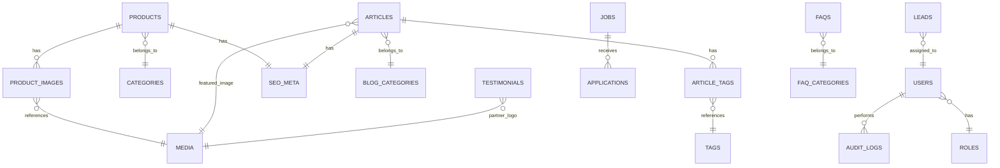

# HUCHA INDONESIA WEBSITE — MASTER BLUEPRINT

### CV Usaha Bintang Mulia | Motorcycle Spareparts, Fluids & Autocare

**Document Owner:** Principal Architecture Team (Planning Only — No Code)
**Purpose:** Single source of truth for an AI build agent (OpenCode) to implement the full system without further clarification.
**Version:** 1.0

---

## HOW TO READ THIS DOCUMENT

This is one master file containing all 50 required sub-documents, numbered exactly as requested. Each section is self-contained but references others via section numbers (e.g. "See §14 Database Design"). An implementation agent should read Part I fully before writing any code, then use Part II/III as the working spec during build, and Part IV as the execution checklist.

**Structure:**

- **Part I — Strategy & Requirements** (§1–7)
- **Part II — Architecture & UX** (§8–13)
- **Part III — Data Layer** (§14–17)
- **Part IV — Admin & Module Specs** (§18–30)
- **Part V — Quality, Security & Ops** (§31–43)
- **Part VI — Delivery Plan** (§44–50)

---

# PART I — STRATEGY & REQUIREMENTS

## 1. Executive Summary

HuCha Indonesia (operated under CV Usaha Bintang Mulia) requires a production-grade, bilingual-ready (Indonesian primary, English optional) corporate + e-commerce-adjacent website serving three business lines: motorcycle spareparts, fluids/lubricants, and autocare products.

The platform is **not a transactional e-commerce store** — it is a **marketing, lead-generation, and content platform** that funnels buyers to existing marketplaces (Tokopedia, Shopee, TikTok Shop) while capturing high-value B2B leads directly (distributors, OEM clients, job applicants). The system must include a full CMS/admin back-end so non-technical staff can manage products, articles, leads, and SEO without developer involvement.

Core outcome: a fast, SEO-optimized, mobile-first site with a lightweight but genuinely useful admin dashboard, built on a maintainable, framework-agnostic architecture that can scale from a single CV (small company) to a multi-brand distributor network.

## 2. Business Goals

| #   | Goal                                                                      | Success Metric                                                       |
| --- | ------------------------------------------------------------------------- | -------------------------------------------------------------------- |
| G1  | Generate qualified distributor/agent leads                                | ≥30 qualified leads/month within 6 months                            |
| G2  | Rank organically for motorcycle autocare/spareparts keywords in Indonesia | Top-10 Google.co.id ranking for ≥15 target keywords within 12 months |
| G3  | Reduce sales team manual work (WA screenshots, spreadsheets)              | 100% of leads captured in structured DB, exportable to CSV/Excel     |
| G4  | Build brand trust/legitimacy for B2B buyers (bengkel, toko onderdil)      | Testimonials + legal transparency pages live at launch               |
| G5  | Enable OEM/maklon B2B inquiries as a secondary revenue channel            | Dedicated OEM funnel live at launch with ≥1 lead/month by month 3    |
| G6  | Support recruitment during business expansion                             | Career module live with applications stored & exportable             |
| G7  | Keep operating cost low (no dedicated IT hire required post-launch)       | Non-technical staff can publish blog/product content unaided         |

## 3. Functional Requirements

Numbered FR-IDs are referenced later in Task Breakdown (§49) and API Spec (§36).

| ID    | Requirement                                                                                                                       |
| ----- | --------------------------------------------------------------------------------------------------------------------------------- |
| FR-01 | Public site renders Home, About, Brands, Products, Distributor, OEM, Career, Blog, Contact, Testimonials, FAQ                     |
| FR-02 | Floating WhatsApp/Instagram/TikTok widget on every public page                                                                    |
| FR-03 | Product catalog with category filter (Spareparts / Fluids / Autocare), search, and detail pages                                   |
| FR-04 | Each product detail links out to Tokopedia/Shopee/TikTok Shop official store URLs                                                 |
| FR-05 | Distributor registration form (Name, Region, WhatsApp, optional business type) with server-side validation                        |
| FR-06 | OEM inquiry form (Company Name, PIC Name, WhatsApp/Email, Product Category of Interest, Message)                                  |
| FR-07 | Career page lists open positions; applicant can submit form + upload CV (PDF/DOC, max 5MB)                                        |
| FR-08 | Blog with categories, tags, SEO fields per article, image upload, and public commenting disabled (SEO-only, no spam vector) at v1 |
| FR-09 | Contact page with embedded Google Maps + general inquiry form                                                                     |
| FR-10 | Testimonials page displaying partner/bengkel success stories (admin-managed, not user-submitted at v1)                            |
| FR-11 | FAQ page with accordion UI, categorized questions                                                                                 |
| FR-12 | Admin authentication (email + password, hashed, session/JWT-based)                                                                |
| FR-13 | Role-based admin dashboard: Super Admin, Content Editor, Sales/Leads Manager                                                      |
| FR-14 | Analytics dashboard: visitor counts (daily/monthly), top articles, lead counts, conversion funnel snapshot                        |
| FR-15 | Lead management module: view, filter, tag status (New/Contacted/Converted/Rejected), export CSV/Excel                             |
| FR-16 | Media Library: centralized upload, auto-compress/optimize images, reusable across products/articles/banners                       |
| FR-17 | SEO Manager: per-page/per-article Meta Title, Meta Description, Slug, Open Graph image, canonical URL                             |
| FR-18 | Email notification triggers for new leads, new applications, new contact messages                                                 |
| FR-19 | All public forms protected by spam prevention (honeypot + rate limiting minimum; CAPTCHA optional v1.1)                           |
| FR-20 | Multi-device responsive rendering (mobile-first, since majority of Indonesian traffic is mobile)                                  |
| FR-21 | Product/Article content manageable entirely via admin UI (no code deploy needed to publish content)                               |

## 4. Non-Functional Requirements

| Category         | Requirement                                                                                                      |
| ---------------- | ---------------------------------------------------------------------------------------------------------------- |
| Performance      | Largest Contentful Paint < 2.5s on 4G; Lighthouse Performance ≥ 85 on product/blog pages                         |
| Scalability      | Must handle 3-year growth: catalog up to ~2,000 SKUs, ~1,000 blog articles, without re-architecture              |
| Availability     | ≥ 99.5% uptime target for production                                                                             |
| Security         | OWASP Top 10 mitigations mandatory (see §32)                                                                     |
| SEO              | Server-rendered or statically-generated HTML for all public pages (no client-only rendering of critical content) |
| Accessibility    | WCAG 2.1 AA baseline for public pages (contrast, alt text, keyboard nav)                                         |
| Maintainability  | Codebase must allow a non-original developer to onboard using this documentation alone                           |
| Localization     | Bahasa Indonesia as default locale; architecture must not hardcode Indonesian strings in logic (i18n-ready)      |
| Data Portability | All lead/article data exportable in open formats (CSV/XLSX/JSON) — no vendor lock-in                             |
| Media            | Images auto-optimized (WebP conversion + compression) on upload                                                  |

## 5. Target Users

1. **End Consumers (Motorcycle Riders)** — browse products, check specs, get redirected to marketplace to buy.
2. **Prospective Distributors / Toko Onderdil / Bengkel Owners** — evaluate credibility, submit partnership form.
3. **OEM/Maklon Clients (B2B)** — businesses wanting private-label manufacturing.
4. **Job Applicants** — browse open roles, apply.
5. **Internal Sales/Marketing Staff (Admin Users)** — manage leads, respond via WhatsApp, track pipeline.
6. **Internal Content/Marketing Editor (Admin Users)** — publish blog articles, manage SEO, manage media.
7. **Company Leadership (Super Admin)** — view analytics, manage all modules and user roles.

## 6. User Personas

**Persona A — "Pak Budi", Bengkel Owner (35–50)**
Owns a small motorcycle repair shop, mobile-first internet user, WhatsApp-dependent, moderate literacy with web forms. Wants: fast credibility check, WhatsApp contact, simple registration. Pain point: distrust of unknown suppliers; needs testimonials & legal legitimacy visible immediately.

**Persona B — "Sarah", Marketing Staff / Content Editor (24–32)**
Non-technical, manages social media + blog. Needs a simple, forgiving CMS UI (like WordPress-level simplicity) to publish articles with SEO fields without asking developers for help.

**Persona C — "Pak Andi", OEM/B2B Procurement Manager (35–55)**
Represents a company wanting private-label autocare products. Desktop-first, values detailed company profile/legality info and a clear, professional inquiry channel (not just WhatsApp).

**Persona D — "Dinda", End Consumer Rider (18–30)**
Mobile-only, price/product-spec conscious, will click through to Tokopedia/Shopee to actually purchase. Wants fast browsing, clear categorization, real product photos.

**Persona E — "Sales/Ops Lead" (Internal, Admin)**
Needs one place to see all incoming leads (distributor + OEM + contact + career) with status tags and CSV export for daily WhatsApp follow-up.

## 7. Complete Feature List

Grouped by module; priority uses MoSCoW (Must/Should/Could/Won't-this-phase).

### 7.1 Public-Facing Features

| Feature                                                     | Priority     |
| ----------------------------------------------------------- | ------------ |
| Home hero + featured products + quick company overview      | Must         |
| Floating WhatsApp/IG/TikTok widget                          | Must         |
| About Us (history, legality, vision/mission)                | Must         |
| Our Brands showcase                                         | Must         |
| Product Catalog (3 categories, filter, search, detail page) | Must         |
| Marketplace redirect buttons per product                    | Must         |
| Distributor Registration form                               | Must         |
| OEM Manufacturing inquiry page                              | Must         |
| Career listing + application form + CV upload               | Must         |
| Blog with categories/tags + SEO metadata rendering          | Must         |
| Contact page + Google Maps embed + contact form             | Must         |
| Testimonials page                                           | Should       |
| FAQ accordion page                                          | Should       |
| Multi-language toggle (ID/EN)                               | Could (v1.1) |
| Newsletter signup                                           | Could (v1.1) |
| On-site product review/comments                             | Won't (v1)   |

### 7.2 Admin/Back-End Features

| Feature                                                        | Priority     |
| -------------------------------------------------------------- | ------------ |
| Auth (login, password reset, session mgmt)                     | Must         |
| Role-based access control (3 roles min.)                       | Must         |
| Product CRUD + category mgmt                                   | Must         |
| Blog CMS (create/edit/delete/publish/draft/schedule)           | Must         |
| SEO Manager fields on Product & Blog                           | Must         |
| Media Library (upload, auto-compress, reuse)                   | Must         |
| Lead Management (Distributor/OEM/Contact/Career unified inbox) | Must         |
| Lead status tagging + notes                                    | Must         |
| CSV/Excel export of leads                                      | Must         |
| Analytics dashboard (visitors, top content, lead counts)       | Must         |
| Testimonial CRUD                                               | Should       |
| FAQ CRUD                                                       | Should       |
| Career posting CRUD                                            | Must         |
| Email notifications on new lead/application                    | Must         |
| Activity/audit log (who edited what, when)                     | Should       |
| Multi-admin user management (invite, deactivate)               | Should       |
| Advanced analytics (funnel, source tracking via UTM)           | Could (v1.1) |
| A/B testing tools                                              | Won't (v1)   |

---

# PART II — ARCHITECTURE & UX

## 8. Website Sitemap

```
/
├── /tentang-kami                  (About Us)
├── /merek-kami                    (Our Brands)
├── /produk                        (Product Catalog)
│   ├── /produk/spareparts
│   ├── /produk/cairan-otomotif
│   ├── /produk/perawatan-kendaraan
│   └── /produk/[slug]             (Product Detail)
├── /kemitraan                     (Become a Distributor)
├── /oem                           (OEM Manufacturing)
├── /karir                         (Career)
│   └── /karir/[slug]              (Job Detail + Apply)
├── /blog
│   ├── /blog/kategori/[slug]
│   └── /blog/[slug]               (Article Detail)
├── /testimoni                     (Testimonials)
├── /faq
├── /kontak                        (Contact)
├── /kebijakan-privasi             (Privacy Policy — legal requirement for forms)
└── /admin                         (Back-end, not indexed — robots: noindex, auth-gated)
    ├── /admin/login
    ├── /admin/dashboard
    ├── /admin/produk
    ├── /admin/blog
    ├── /admin/leads
    ├── /admin/karir
    ├── /admin/testimoni
    ├── /admin/faq
    ├── /admin/media
    ├── /admin/seo
    ├── /admin/analytics
    ├── /admin/users
    └── /admin/settings
```

## 9. Information Architecture

**Content model groups:**

1. **Corporate Content** (About, Brands, Legal, Privacy) — mostly static, admin-editable text blocks.
2. **Commerce-Adjacent Content** (Products, Categories, Brands) — structured catalog data, no cart/checkout.
3. **Lead-Generating Content** (Distributor, OEM, Career, Contact) — forms → Leads table.
4. **Editorial Content** (Blog, Testimonials, FAQ) — CMS-managed, versioned, SEO-tagged.
5. **Operational Content** (Admin-only: Analytics, Media, Users, Settings) — not publicly indexed.

**Taxonomy:**

- Product Category (3 fixed top-level: Spareparts, Fluids & Lubricants, Autocare) → Sub-category (e.g., Kampas Rem, Oli Sokbreker) → Product.
- Blog Category (e.g., Tips Perawatan, Pemilihan Cairan, Berita Perusahaan) → Tags (freeform, many-to-many).

## 10. Navigation Structure

**Primary Nav (Header):** Beranda | Tentang Kami | Merek Kami | Produk ▾ | Kemitraan | OEM | Blog | Karir | Kontak

**Produk Dropdown:** Spareparts | Cairan Otomotif | Perawatan Kendaraan | Lihat Semua Produk

**Footer Nav:** Tentang Kami, Merek Kami, FAQ, Testimoni, Kebijakan Privasi, Karir, Kontak, Social icons (IG/TikTok/WA), Marketplace badges (Tokopedia/Shopee/TikTok Shop logos linking to official stores).

**Persistent Elements:** Floating action button (bottom-right) expanding to WhatsApp / Instagram / TikTok — present on all public pages except `/admin/*`.

**Admin Sidebar Nav:** Dashboard, Produk, Blog, Leads, Karir, Testimoni, FAQ, Media Library, SEO Manager, Analytics, Users & Roles, Settings, Logout.

## 11. User Flow (Public)

**Flow A — Distributor Signup**
Landing → sees credibility signals (testimonials, brand showcase) → clicks "Kemitraan" → reads benefits → fills form (Name, Region, WhatsApp) → client-side + server-side validation → submit → success screen with WhatsApp CTA ("Chat kami untuk proses lebih cepat") → data stored in Leads table with type=`distributor`, status=`new` → email notification to Sales Manager role.

**Flow B — Consumer Purchase Redirect**
Landing/Blog article (SEO entry) → Product Catalog → filter by category → Product Detail page → clicks marketplace badge → new tab opens Tokopedia/Shopee/TikTok Shop listing. (No cart/checkout on this site — by design, per business model.)

**Flow C — OEM Inquiry**
Landing → "OEM" nav → reads manufacturing capability page → fills OEM form (Company, PIC, Contact, Category of Interest, Message) → submit → stored as Lead type=`oem` → notification to Super Admin + Sales Manager.

**Flow D — Career Application**
Landing → "Karir" → browses open roles → selects role → fills application form + uploads CV → submit → stored in Applications table, file stored via Media/Storage service → notification to HR-tagged admin.

## 12. Admin Flow

**Login → Dashboard → Module.**

1. Admin logs in (`/admin/login`) → JWT/session issued, role loaded.
2. Dashboard shows: visitor snapshot, new leads count (unread), top 5 articles, quick links.
3. Sales/Leads Manager role → routed by default emphasis to `/admin/leads`; can view/filter/tag/export.
4. Content Editor role → primary workspace `/admin/blog` and `/admin/produk`; can upload media inline (opens Media Library picker modal).
5. Super Admin → full access including `/admin/users` (invite/deactivate admins, assign roles) and `/admin/settings` (site-wide config, SMTP, integrations).
6. Every create/update/delete action writes to an audit log entry (actor, action, entity, timestamp).

## 13. CMS Flow (Blog/Product Content)

1. Editor clicks "New Article" → form: Title (auto-generates slug, editable), Category, Tags, Featured Image (Media Library picker), Body (rich text editor), Excerpt.
2. SEO tab within same form: Meta Title (defaults to Title, editable, char-count guide ~60), Meta Description (char-count guide ~155), Slug override, OG Image override, Canonical URL (auto, editable).
3. Status control: Draft → Preview (unlisted preview link) → Publish (immediately) or Schedule (future datetime).
4. On publish: sitemap.xml regenerated/flagged for regeneration; cache invalidated for `/blog` listing + new article page.
5. Product creation mirrors this flow: Name, Category/Sub-category, Description, Images (multi, via Media Library), Marketplace links (Tokopedia URL, Shopee URL, TikTok Shop URL — each optional but ≥1 required), SEO tab identical pattern.

---

# PART III — DATA LAYER

## 14. Database Design

**Engine recommendation:** PostgreSQL (relational integrity for leads/roles matters; JSONB available for flexible fields like product specs).

**Design principles:**

- Soft deletes (`deleted_at`) on content tables (Product, Article, Testimonial, Job) to allow recovery and preserve historical lead references.
- All lead-capturing tables share a common shape via a unified `leads` table with a `type` discriminator, rather than 4 separate near-duplicate tables — simplifies the Admin Lead Inbox (FR-15) into one query surface.
- Every content entity with public SEO exposure (`Product`, `Article`) has a 1:1 `seo_meta` relation rather than duplicating SEO columns across tables — keeps SEO Manager (§27) generic and reusable.
- Media is centralized in a `media` table; other tables reference it by FK, never store duplicate files.

## 15. ERD (Textual/Mermaid)



## 16. Entity Definitions

| Entity                  | Key Fields                                                                                                                                                                                                                                                                                      |
| ----------------------- | ----------------------------------------------------------------------------------------------------------------------------------------------------------------------------------------------------------------------------------------------------------------------------------------------- |
| **users**               | id, name, email (unique), password_hash, role_id (FK), is_active, last_login_at, created_at                                                                                                                                                                                                     |
| **roles**               | id, name (`super_admin`, `content_editor`, `sales_manager`), permissions (JSONB)                                                                                                                                                                                                                |
| **categories**          | id, name, slug, type (enum: spareparts/fluids/autocare), parent_id (nullable, for sub-category)                                                                                                                                                                                                 |
| **products**            | id, name, slug, category_id (FK), sub_category_id (nullable FK), short_description, description (rich text), tokopedia_url, shopee_url, tiktokshop_url, is_featured, status (draft/published), deleted_at                                                                                       |
| **product_images**      | id, product_id (FK), media_id (FK), sort_order                                                                                                                                                                                                                                                  |
| **blog_categories**     | id, name, slug                                                                                                                                                                                                                                                                                  |
| **tags**                | id, name, slug                                                                                                                                                                                                                                                                                  |
| **articles**            | id, title, slug, blog_category_id (FK), featured_media_id (FK), excerpt, body (rich text), status (draft/scheduled/published), published_at, author_id (FK users), deleted_at                                                                                                                   |
| **article_tags**        | article_id (FK), tag_id (FK) — composite PK                                                                                                                                                                                                                                                     |
| **seo_meta**            | id, entity_type (enum: product/article), entity_id, meta_title, meta_description, slug_override, og_image_media_id (nullable FK), canonical_url                                                                                                                                                 |
| **media**               | id, file_name, file_path/url, mime_type, size_bytes, alt_text, width, height, uploaded_by (FK users), created_at                                                                                                                                                                                |
| **jobs**                | id, title, slug, department, location, employment_type, description, requirements, status (open/closed), deleted_at                                                                                                                                                                             |
| **applications**        | id, job_id (FK), full_name, email, phone, cv_media_id (FK media), cover_note, status (new/reviewed/rejected/hired), created_at                                                                                                                                                                  |
| **leads**               | id, type (enum: distributor/oem/contact/career_note), full_name, company_name (nullable), region (nullable), whatsapp, email (nullable), message, category_of_interest (nullable, for OEM), status (new/contacted/converted/rejected), assigned_to (nullable FK users), source_page, created_at |
| **testimonials**        | id, partner_name, partner_business, quote, partner_logo_media_id (nullable FK), rating (nullable int), is_published, deleted_at                                                                                                                                                                 |
| **faq_categories**      | id, name, slug                                                                                                                                                                                                                                                                                  |
| **faqs**                | id, faq_category_id (FK), question, answer, sort_order, is_published                                                                                                                                                                                                                            |
| **audit_logs**          | id, user_id (FK), action (create/update/delete/publish/login), entity_type, entity_id, meta (JSONB diff), created_at                                                                                                                                                                            |
| **analytics_snapshots** | id, date, unique_visitors, page_views, top_articles (JSONB), new_leads_count                                                                                                                                                                                                                    |
| **settings**            | key (PK), value (JSONB) — site-wide config: SMTP, social links, company legal info, GA/GTM IDs                                                                                                                                                                                                  |

## 17. Relationship Definitions

- `users (1) — (N) audit_logs` : one user performs many logged actions.
- `roles (1) — (N) users` : one role assigned to many users.
- `categories (1) — (N) products` and self-referencing `categories (1) — (N) categories` for sub-categories.
- `products (1) — (N) product_images` , `product_images (N) — (1) media`.
- `products (1) — (1) seo_meta` (polymorphic via entity_type/entity_id, enforced at application layer, not FK, since seo_meta serves two parent tables).
- `articles (N) — (N) tags` via `article_tags` join table.
- `articles (N) — (1) blog_categories`, `articles (1) — (1) seo_meta` (same polymorphic pattern).
- `jobs (1) — (N) applications`.
- `leads (N) — (1) users` via nullable `assigned_to` (a lead may be unassigned initially).
- `testimonials (N) — (1) media` for optional partner logo.
- `faq_categories (1) — (N) faqs`.
- Cascade rules: deleting a `category` with existing `products` is **blocked at application layer** (must reassign or soft-delete products first) — prevents orphaned catalog items.

---

# PART IV — ADMIN & MODULE SPECS

## 18. Admin Modules

1. Dashboard (overview widgets)
2. Product Manager
3. Blog/CMS Manager
4. Leads Inbox (unified: distributor + OEM + contact)
5. Career Manager (jobs + applications)
6. Testimonial Manager
7. FAQ Manager
8. Media Library
9. SEO Manager (cross-cutting panel embedded in Product & Blog forms + a standalone audit view)
10. Analytics
11. User & Role Management
12. Settings (integrations, company info, SMTP)
13. Audit Log Viewer (read-only, Super Admin only)

## 19. Roles & Permissions

| Capability                    | Super Admin | Content Editor            | Sales Manager          |
| ----------------------------- | ----------- | ------------------------- | ---------------------- |
| Manage Products               | ✅          | ✅                        | ❌ (view only)         |
| Manage Blog/Articles          | ✅          | ✅                        | ❌                     |
| Manage Media Library          | ✅          | ✅                        | ❌ (view only)         |
| Manage SEO fields             | ✅          | ✅                        | ❌                     |
| View/Manage Leads (all types) | ✅          | ❌ (view only, no edit)   | ✅                     |
| Export Leads CSV/Excel        | ✅          | ❌                        | ✅                     |
| Manage Career Postings        | ✅          | ✅                        | ❌                     |
| View Applications             | ✅          | ❌                        | ✅                     |
| Manage Testimonials/FAQ       | ✅          | ✅                        | ❌                     |
| View Analytics                | ✅          | ✅ (content-related only) | ✅ (lead-related only) |
| Manage Users & Roles          | ✅          | ❌                        | ❌                     |
| Manage Settings/Integrations  | ✅          | ❌                        | ❌                     |
| View Audit Log                | ✅          | ❌                        | ❌                     |

Permission model implemented as a JSONB permission map on `roles` (not hardcoded in application logic) so future roles can be added without schema migration.

## 20. Dashboard Specification

**Purpose:** Single landing screen after login giving actionable status at a glance.
**Business Value:** Reduces time-to-action for sales staff; gives leadership a no-login-required sense of platform health.
**User Story:** "As a Sales Manager, I want to see new unread leads immediately when I log in, so I can respond same-day."

**Widgets:**

- New Leads (last 7 days), broken down by type, with unread badge.
- Visitor count (today, this month) — line chart.
- Top 5 most-read articles (last 30 days).
- Pending job applications count.
- Quick-action buttons: "New Article", "New Product", "View All Leads".

**Acceptance Criteria:**

- Dashboard loads in <1.5s with cached/pre-aggregated data (not live-computed on every page load).
- Widgets respect role permissions (Content Editor doesn't see raw lead contact details, only counts).

**Edge Cases:** Zero-data states (new install) must show friendly empty states, not broken charts.
**Priority:** Must. **Dependencies:** Analytics Specification (§28), Leads module (§22).

## 21. Product Module Specification

**Purpose:** Central catalog management for 3 product categories.
**Business Value:** Enables non-technical staff to keep the public catalog current without developer involvement, directly supporting marketplace redirect conversions (G1–G2).
**User Story:** "As a Content Editor, I want to add a new product with images and marketplace links, so customers can find and buy it on Tokopedia/Shopee/TikTok Shop."

**Acceptance Criteria:**

- Product form requires: Name, Category, at least 1 image, at least 1 marketplace URL, Status.
- Slug auto-generated from name, must be unique, editable.
- Public product page renders all provided marketplace buttons only (hide empty ones).
- Draft products never appear in public catalog, sitemap, or search.

**Edge Cases:** Product with zero marketplace links cannot be published (validation blocks it — publishing a dead-end page harms conversion & SEO). Duplicate slug attempts auto-suffix (`-2`) with editor confirmation.
**Validation Rules:** Name 3–120 chars; at least one of tokopedia_url/shopee_url/tiktokshop_url must be a valid URL; images max 5, each ≤5MB, auto-converted to WebP.
**Priority:** Must. **Dependencies:** Media Library (§26), SEO Manager (§27), Categories seed data.

## 22. Distributor Module Specification

**Purpose:** Capture and manage partnership/agent leads.
**Business Value:** Directly drives G1 (lead generation) and G3 (structured data replacing manual WA/Excel tracking).
**User Story:** "As a bengkel owner, I want to quickly register interest with minimal fields, so I don't abandon the form on mobile."

**Acceptance Criteria:**

- Public form: Full Name, Region/Wilayah (free text or dropdown of Indonesian provinces), WhatsApp number, optional business type.
- On submit, lead stored with `type=distributor`, `status=new`, `source_page` captured for analytics.
- Confirmation screen shows success message + direct WhatsApp deep-link.
- Admin (Sales Manager) can filter by region, status, date range; bulk export to CSV/XLSX.

**Edge Cases:** WhatsApp number entered with/without country code (+62) both normalized on save. Duplicate submissions from same number within 24h flagged (not blocked) as "possible duplicate" for sales review.
**Validation Rules:** Name required, 3–100 chars; WhatsApp required, must match Indonesian mobile pattern (`^(\+62|62|0)8[1-9][0-9]{6,10}$`) after normalization.
**Priority:** Must. **Dependencies:** Leads unified table (§16), Email notification (§29–30).

## 23. OEM Module Specification

**Purpose:** B2B channel for private-label manufacturing inquiries.
**Business Value:** Secondary revenue stream (G5); requires higher-trust content (company legality, production capability) than the consumer-facing catalog.
**User Story:** "As a procurement manager, I want to describe my manufacturing needs and get a serious, professional response channel — not just a chat bubble."

**Acceptance Criteria:**

- Page includes: manufacturing capability overview, minimum order info (if disclosed), certifications/legality mention, and inquiry form.
- Form fields: Company Name, PIC Name, Contact (WhatsApp and/or Email — at least one required), Product Category of Interest (dropdown: Fluids/Autocare/Other), Message (min 20 chars to avoid low-effort spam).
- Stored as lead `type=oem`; routed by default to Super Admin + Sales Manager (higher-priority notification than standard distributor leads).

**Edge Cases:** Message field flooded with URLs/spam pattern → flagged, not auto-rejected (avoid false negatives on legit leads).
**Validation Rules:** At least one contact method valid (email regex or WA pattern); message 20–2000 chars.
**Priority:** Must. **Dependencies:** Leads module, Email notifications.

## 24. Career Module Specification

**Purpose:** Recruitment listing + application intake.
**Business Value:** Supports G6 (expansion hiring) without third-party job board cost.
**User Story:** "As an admin, I want to post a new open role and receive applications with CVs in one place."

**Acceptance Criteria:**

- Job posting fields: Title, Department, Location, Employment Type, Description, Requirements, Status (open/closed).
- Closed jobs remain viewable via direct link (for record) but excluded from public listing and sitemap.
- Applicant form: Full Name, Email, Phone, CV upload (PDF/DOC/DOCX, max 5MB), optional cover note.
- Admin can view/download CVs, change application status (new/reviewed/rejected/hired).

**Edge Cases:** CV upload failure (oversized/wrong format) shows inline error before submission attempt, not after. Applying to a job that closes mid-session shows a graceful "posisi telah ditutup" message rather than a broken submit.
**Validation Rules:** Email format validated; file type whitelist enforced server-side (not just client `accept` attribute, to prevent bypass).
**Priority:** Must. **Dependencies:** Media/file storage, Email notifications.

## 25. Blog Module Specification

**Purpose:** SEO content engine.
**Business Value:** Primary driver of organic traffic (G2), positions HuCha as an authority on motorcycle care.
**User Story:** "As a Content Editor, I want to write, categorize, tag, and SEO-optimize an article without touching code."

**Acceptance Criteria:**

- Rich text editor supports headings, bold/italic, lists, links, inline images (via Media Library picker), embedded YouTube (optional).
- SEO tab (§13) mandatory before publish: meta title and meta description must be filled (validation warning, not hard block, to avoid stalling urgent publishes).
- Scheduled publishing supported (publish at future datetime via background job).
- Auto-generates `sitemap.xml` entry and internal related-articles suggestion (same category, latest 3).

**Edge Cases:** Editing a published article's slug prompts a warning about breaking existing external links/SEO equity; recommends adding a redirect (v1.1 feature) or keeping the slug.
**Validation Rules:** Title 10–120 chars; body min 100 words (soft warning, encourages real SEO content, not blocking).
**Priority:** Must. **Dependencies:** Media Library, SEO Manager, Categories/Tags seed data.

## 26. Media Library Specification

**Purpose:** Centralized asset management with automatic optimization.
**Business Value:** Prevents the #1 cause of slow Indonesian mobile-web experiences: unoptimized images (directly supports Performance NFR and G2 SEO ranking).
**User Story:** "As any content-role admin, I want to upload an image once and reuse it across products/articles without re-uploading."

**Acceptance Criteria:**

- On upload: auto-resize to max dimension (e.g., 1920px longest edge), convert to WebP, generate thumbnail variant for grid views.
- Library view supports search/filter by filename, upload date, "used in" reference count.
- Alt text field mandatory before an image can be attached to a public-facing entity (accessibility + SEO NFR).

**Edge Cases:** Attempting to delete a media item still referenced by a published product/article blocks deletion with a list of dependents shown.
**Validation Rules:** Max upload size 10MB pre-compression; allowed types: jpg/png/webp (images), pdf/doc/docx (CVs only, separate namespace from image library).
**Priority:** Must. **Dependencies:** Storage backend (see §39/40), used by Product/Blog/Career/Testimonial modules.

## 27. SEO Manager Specification

**Purpose:** Give every public content entity first-class, editable SEO metadata.
**Business Value:** Directly enables G2 (organic ranking) without developer involvement for every new page.
**User Story:** "As a Content Editor, I want to see live character counts for meta title/description so I know if Google will truncate them."

**Acceptance Criteria:**

- Embedded SEO tab inside Product and Article forms (per §13/§16 `seo_meta` entity).
- Standalone SEO Audit view: lists all published entities missing meta title/description, or with titles/descriptions outside recommended length (title >60 or description >155 chars flagged, not blocked).
- Auto-generates `sitemap.xml` and per-page canonical tags; auto-generates default `og:image` fallback (site logo) if none set.
- Auto `robots.txt` config excludes `/admin/*`.

**Edge Cases:** Non-ASCII/Indonesian diacritics in slugs are transliterated to URL-safe ASCII automatically.
**Priority:** Must. **Dependencies:** Product & Blog modules.

## 28. Analytics Specification

**Purpose:** Give leadership and staff visibility into traffic and lead conversion without needing a separate paid analytics contract at v1.
**Business Value:** Supports data-driven iteration on G1/G2; internal snapshot avoids waiting on external GA dashboards for daily ops.
**User Story:** "As Sales Manager, I want to see how many distributor leads came in this week vs last week."

**Acceptance Criteria:**

- Daily `analytics_snapshots` job aggregates: unique visitors, page views, top 10 articles/products by views, lead counts by type.
- Dashboard (§20) surfaces trailing 7/30-day views with simple line/bar charts.
- Google Analytics 4 / Google Tag Manager integration hook available via Settings (config-only, not hardcoded) for deeper external analysis.

**Edge Cases:** Bot/crawler traffic filtered from visitor counts (basic user-agent filtering minimum).
**Priority:** Must. **Dependencies:** Settings module for GA4/GTM keys.

## 29. Notification System

**Purpose:** Ensure no lead or application goes unnoticed.
**Business Value:** Directly protects G1/G5/G6 — a lead that isn't acted on within 24–48h has sharply lower conversion.
**User Story:** "As a Sales Manager, I want an email the moment a new distributor lead is submitted."

**Acceptance Criteria:**

- Trigger events: new lead (any type), new job application, new contact message.
- Notification recipients configurable per lead-type in Settings (e.g., OEM leads → Super Admin + Sales Manager; Career applications → tagged HR admin).
- In-app notification badge on Admin sidebar (unread count) in addition to email.

**Edge Cases:** Email delivery failure logged and retried (max 3 attempts, exponential backoff) — failure must not block the lead from being saved (DB write always succeeds first, notification is best-effort async).
**Priority:** Must. **Dependencies:** Email Flow (§30), Settings.

## 30. Email Flow

| Trigger                        | Recipient                      | Template                                       |
| ------------------------------ | ------------------------------ | ---------------------------------------------- |
| New distributor lead           | Sales Manager(s)               | "Lead Kemitraan Baru: {name} – {region}"       |
| New OEM inquiry                | Super Admin + Sales Manager    | "Inquiry OEM Baru: {company_name}"             |
| New contact message            | Sales Manager(s)               | "Pesan Kontak Baru dari {name}"                |
| New job application            | HR-tagged admin(s)             | "Lamaran Baru: {job_title} – {applicant_name}" |
| Admin password reset requested | Requesting admin               | Secure time-limited reset link (1hr expiry)    |
| Scheduled article published    | Content Editor who authored it | "Artikel Anda '{title}' telah terbit"          |

All templates are plain, professional, Bahasa Indonesia by default; transactional only (no marketing email sending in v1 — avoids anti-spam/compliance scope creep).

---

# PART V — QUALITY, SECURITY & OPS

## 31. Validation Rules (Consolidated Reference)

| Field                    | Rule                                                                                           |
| ------------------------ | ---------------------------------------------------------------------------------------------- |
| Email                    | RFC 5322-compatible regex, max 255 chars                                                       |
| Indonesian WhatsApp      | Normalize `0`/`62`/`+62` prefixes to a single canonical `+62` format; 9–13 digits after prefix |
| Slug                     | Lowercase, ASCII, hyphen-separated, unique per entity type                                     |
| Image upload             | jpg/png/webp only, ≤10MB pre-compression                                                       |
| CV upload                | pdf/doc/docx only, ≤5MB                                                                        |
| Meta title               | Recommended ≤60 chars (soft warning)                                                           |
| Meta description         | Recommended ≤155 chars (soft warning)                                                          |
| Password (admin)         | Min 10 chars, at least 1 number + 1 letter, checked against common-password blocklist          |
| Free-text message fields | Min length to reduce spam (20 chars for OEM message), max 2000 chars, HTML-stripped on save    |

## 32. Security Requirements

- Passwords hashed with bcrypt/argon2 (never reversible encryption).
- All admin routes behind authentication middleware + role check on every mutating request (not just UI hiding).
- CSRF protection on all state-changing form submissions.
- Rate limiting on all public form endpoints (e.g., 5 submissions/IP/hour) to prevent spam/abuse.
- Honeypot field on all public forms as baseline bot deterrent; CAPTCHA (e.g., hCaptcha) reserved as v1.1 escalation if spam volume warrants it.
- File upload validation server-side by MIME sniffing, not just extension/client `accept`.
- SQL injection prevented via parameterized queries/ORM exclusively — no raw string concatenation.
- XSS prevented via output encoding + sanitized rich-text HTML (whitelist-based sanitizer on article/product body before render).
- Admin session timeout after configurable inactivity (default 60 min); forced re-login.
- Audit log is append-only (no update/delete permission on `audit_logs` table, even for Super Admin, at the application layer).
- All secrets (DB credentials, SMTP, JWT signing key) via environment variables only — never committed to source control (§41).
- HTTPS enforced everywhere (HSTS header); no mixed content.

## 33. Performance Requirements

- Public pages server-rendered or statically generated at build/publish time where content doesn't change per-request (Product, Article, About, Brands).
- Images served via CDN-friendly paths, WebP with responsive `srcset` sizes.
- Database indexes required on: `products.slug`, `articles.slug`, `leads.type`, `leads.status`, `leads.created_at`, `products.category_id`.
- Admin dashboard analytics pre-aggregated nightly (not computed live per page load).
- Target: Time to First Byte < 600ms on public pages under normal load.

## 34. Accessibility Requirements

- WCAG 2.1 AA baseline: color contrast ≥4.5:1 for body text, all interactive elements keyboard-navigable, all images require alt text (enforced at Media Library upload, §26).
- Forms: every input has an associated `<label>`; error messages announced via ARIA live regions.
- Focus states visible (no `outline: none` without replacement).

## 35. SEO Strategy

- Target keyword clusters (from proposal domain): "kampas rem motor terbaik", "cara pilih oli sokbreker", "distributor spareparts motor", "produk perawatan motor original", "agen suku cadang motor [region]".
- Blog content calendar strategy: educational articles (tips perawatan) targeting long-tail informational queries, feeding internal links to relevant Product pages (content → catalog conversion path).
- Technical SEO: auto sitemap.xml, robots.txt excluding `/admin`, canonical tags, structured data (schema.org `Product` and `Article` JSON-LD) on relevant pages.
- Local SEO: Google Business Profile integration recommendation (external, operational task, not code) + NAP (Name/Address/Phone) consistency on Contact page.

## 36. API Specification (Representative Endpoints)

Framework-agnostic REST convention (implementation agent may adapt to chosen stack's idioms, but must preserve these resources/verbs/auth rules).

| Method              | Endpoint                                | Auth                             | Purpose                      |
| ------------------- | --------------------------------------- | -------------------------------- | ---------------------------- |
| GET                 | `/api/products?category=&search=&page=` | Public                           | List/filter products         |
| GET                 | `/api/products/{slug}`                  | Public                           | Product detail               |
| POST                | `/api/leads/distributor`                | Public (rate-limited)            | Submit distributor form      |
| POST                | `/api/leads/oem`                        | Public (rate-limited)            | Submit OEM inquiry           |
| POST                | `/api/leads/contact`                    | Public (rate-limited)            | Submit contact form          |
| GET                 | `/api/jobs`                             | Public                           | List open jobs               |
| POST                | `/api/jobs/{id}/apply`                  | Public (rate-limited, multipart) | Submit application + CV      |
| GET                 | `/api/blog?category=&tag=&page=`        | Public                           | List articles                |
| GET                 | `/api/blog/{slug}`                      | Public                           | Article detail               |
| POST                | `/admin/api/auth/login`                 | Public (credentials)             | Admin login                  |
| GET/POST/PUT/DELETE | `/admin/api/products`                   | Admin (role: editor+)            | Product CRUD                 |
| GET/POST/PUT/DELETE | `/admin/api/articles`                   | Admin (role: editor+)            | Article CRUD                 |
| GET                 | `/admin/api/leads?type=&status=`        | Admin (role: sales+)             | Leads inbox                  |
| PUT                 | `/admin/api/leads/{id}`                 | Admin (role: sales+)             | Update lead status/notes     |
| GET                 | `/admin/api/leads/export`               | Admin (role: sales+)             | CSV/XLSX export              |
| POST                | `/admin/api/media/upload`               | Admin (editor+)                  | Upload + auto-optimize media |
| GET                 | `/admin/api/analytics/summary`          | Admin                            | Dashboard aggregate data     |
| POST/PUT            | `/admin/api/users`                      | Admin (super_admin only)         | Manage admin accounts        |

All admin endpoints require: valid session/JWT AND role-permission check matching §19 table AND (for mutations) CSRF token.

## 37. Folder Architecture Recommendation

Framework-agnostic layered structure (adapt naming to eventual chosen stack, but preserve separation of concerns):

```
/app or /src
  /public-web        → public site pages/views
  /admin-web         → admin dashboard pages/views
  /api                → route handlers/controllers
  /domain
    /products
    /articles
    /leads
    /jobs
    /media
    /seo
    /analytics
    /users
  /infrastructure
    /database         → migrations, models/schemas
    /storage          → file/media storage adapter
    /email            → notification/email adapter
    /auth              → session/JWT, RBAC middleware
  /shared
    /validation        → shared validation schemas (used by both public forms and API)
    /utils
  /config              → environment-driven config loader (no hardcoded secrets)
/tests
  /unit
  /integration
  /e2e
/docs                  → this blueprint + any ADRs
```

Principle: **domain-first, not framework-first** — business logic (products/leads/jobs) must not be entangled with routing/framework code, so a future framework migration doesn't require rewriting business rules.

## 38. Coding Standards

- Consistent naming: snake_case for DB columns, camelCase for application-layer variables/functions (or match chosen language convention consistently).
- One responsibility per module/file (no "god files" mixing DB access, validation, and presentation).
- All validation rules (§31) defined once in `/shared/validation` and reused by both client-facing forms and server API — never duplicated/drifted.
- No secrets, API keys, or credentials in source code — environment variables only (§41).
- All public form submissions and admin mutations must have automated tests (§42) before being considered "done".
- Commit messages reference the Task Breakdown ID (§49) they implement.
- Every new admin module includes an audit-log write for create/update/delete actions.

## 39. Deployment Architecture

```
[User Browser] → [CDN / Reverse Proxy (HTTPS termination)] → [App Server(s)]
                                                                  ├── Public Web Rendering
                                                                  ├── Admin Web Rendering
                                                                  └── API Layer
                        [App Server(s)] → [PostgreSQL DB]
                        [App Server(s)] → [Object Storage] (media/CV files)
                        [App Server(s)] → [SMTP Provider] (email notifications)
                        [Scheduled Job Runner] → nightly analytics aggregation, scheduled blog publishing
```

- Recommended hosting pattern: containerized app server behind a reverse proxy/CDN (e.g., Cloudflare) for static asset caching and DDoS mitigation.
- Object storage (S3-compatible) for media/CVs — never store uploaded files on ephemeral app-server local disk in production.
- Database backups: automated daily snapshot, retained ≥14 days minimum.

## 40. Docker Architecture

Recommended multi-service composition (names indicative, adapt to chosen stack):

```
services:
  app:            # main application (public + admin + API)
  db:             # PostgreSQL
  object-storage: # local MinIO for dev parity with production S3-compatible storage
  mailhog:        # local SMTP catcher for dev email testing
  job-runner:     # scheduled tasks (analytics aggregation, scheduled publish)
```

- `app` depends on `db` and `object-storage` being healthy before start.
- Separate `docker-compose.dev.yml` (hot-reload, mailhog/minio) vs production compose (real SMTP/S3 endpoints via env vars only, no dev-only services).
- No secrets baked into images — all via `.env` file (dev) / secret manager (production), per §41.

## 41. Environment Variables

| Variable                                                                 | Purpose                                                       |
| ------------------------------------------------------------------------ | ------------------------------------------------------------- |
| `APP_ENV`                                                                | `development` / `staging` / `production`                      |
| `APP_URL`                                                                | Canonical site URL (used for SEO canonical tags, email links) |
| `DATABASE_URL`                                                           | PostgreSQL connection string                                  |
| `JWT_SECRET` / `SESSION_SECRET`                                          | Auth token signing key                                        |
| `STORAGE_ENDPOINT` / `STORAGE_BUCKET` / `STORAGE_KEY` / `STORAGE_SECRET` | Object storage credentials                                    |
| `SMTP_HOST` / `SMTP_PORT` / `SMTP_USER` / `SMTP_PASS` / `SMTP_FROM`      | Email delivery                                                |
| `GA4_MEASUREMENT_ID` / `GTM_ID`                                          | Analytics integration (optional)                              |
| `RATE_LIMIT_WINDOW` / `RATE_LIMIT_MAX`                                   | Public form abuse prevention tuning                           |
| `WHATSAPP_ADMIN_NUMBER`                                                  | Number used for floating WA widget deep-link                  |
| `NODE_ENV` or stack-equivalent                                           | Runtime mode                                                  |

All variables documented in a checked-in `.env.example` with placeholder (never real) values.

## 42. Testing Strategy

| Layer         | Scope                                                                                  | Tooling Guidance (stack-agnostic)                           |
| ------------- | -------------------------------------------------------------------------------------- | ----------------------------------------------------------- |
| Unit          | Validation rules, WhatsApp normalization, slug generation, permission checks           | Fast, no DB/network dependency                              |
| Integration   | API endpoints against a real test DB (leads submission, product CRUD, auth flow)       | Isolated test database, reset between runs                  |
| E2E           | Critical public user flows (§11 Flow A–D) and admin login→create→publish flow          | Headless browser automation                                 |
| Security      | Automated dependency vulnerability scanning; manual OWASP checklist pass before launch | CI-integrated scanner                                       |
| Accessibility | Automated axe-core scan on public pages as part of CI                                  | CI-integrated                                               |
| Performance   | Lighthouse CI budget checks on Home/Product/Blog templates                             | CI-integrated, fail build if budget regresses significantly |

Minimum bar before "production-ready": all Must-priority features (§7) have passing integration tests + at least one E2E happy-path test.

## 43. Risk Analysis

| Risk                                                           | Likelihood                 | Impact | Mitigation                                                                                                     |
| -------------------------------------------------------------- | -------------------------- | ------ | -------------------------------------------------------------------------------------------------------------- |
| Spam form submissions overwhelm Leads inbox                    | Medium                     | Medium | Honeypot + rate limit at launch; CAPTCHA escalation ready as v1.1 toggle                                       |
| Non-technical staff struggle with CMS                          | Medium                     | High   | Simple, opinionated CMS UI; internal training doc (deliverable alongside build)                                |
| SEO underperformance vs marketplace-native competitors         | Medium                     | High   | Dedicated blog content strategy (§35) from week 1, not an afterthought                                         |
| Image-heavy pages hurt mobile performance                      | High (common in ID market) | High   | Mandatory auto-optimization pipeline (§26), enforced not optional                                              |
| Scope creep (adding e-commerce cart mid-project)               | Medium                     | High   | Explicit non-goal documented in §1; any cart request routed to a formal Phase 2 proposal, not squeezed into v1 |
| Single developer/agent dependency post-launch                  | Medium                     | Medium | This documentation set + coding standards (§38) exist specifically to de-risk this                             |
| Lead data loss (form succeeds but notification fails silently) | Low                        | High   | DB write always precedes notification send (§29); notification failure never blocks/loses the lead record      |

---

# PART VI — DELIVERY PLAN

## 44. Future Roadmap (v1.1+)

- Multi-language toggle (ID/EN) for OEM/export-facing pages.
- CAPTCHA escalation if spam volume exceeds threshold.
- UTM-based source tracking for deeper funnel analytics.
- Newsletter signup + basic email marketing integration.
- On-site testimonial submission form (currently admin-curated only).
- Slug-change redirect management (301 mapping table).

## 45. Future Improvements

- Full-text search across products + articles (e.g., dedicated search index) once catalog exceeds ~500 SKUs.
- Distributor portal (private login area for approved agents to see pricing/stock — separate, larger initiative).
- Automated WhatsApp Business API integration for lead auto-reply (currently manual via floating widget deep-link).

## 46. Development Phases

**Phase 0 — Foundation (Week 1–2):** Environment setup, DB schema migration, auth/RBAC scaffolding, folder architecture, CI pipeline skeleton.
**Phase 1 — Core Public Site (Week 3–5):** Home, About, Brands, Product Catalog (public), Contact, static legal pages.
**Phase 2 — Lead Modules (Week 5–7):** Distributor, OEM, Career (public + application), unified Leads admin inbox, email notifications.
**Phase 3 — CMS & SEO (Week 7–9):** Blog CMS, Media Library, SEO Manager, Testimonials, FAQ.
**Phase 4 — Admin Depth (Week 9–10):** Analytics dashboard, Users & Roles, Audit Log, Settings.
**Phase 5 — Hardening (Week 10–12):** Security pass (§32), performance/Lighthouse tuning (§33), accessibility audit (§34), full test suite (§42), content population, staging UAT.
**Phase 6 — Launch (Week 12–13):** Production deploy, DNS cutover, monitoring setup, post-launch smoke tests.

## 47. Milestones

| Milestone                       | Target      | Definition of Done                                                    |
| ------------------------------- | ----------- | --------------------------------------------------------------------- |
| M1 — Foundation Ready           | End Phase 0 | Auth works, schema migrated, CI green on empty scaffold               |
| M2 — Public Site Live (staging) | End Phase 1 | All static/catalog pages render correctly, mobile-responsive          |
| M3 — Lead Capture Functional    | End Phase 2 | All 4 forms submit, validate, notify, and appear in admin inbox       |
| M4 — Content Engine Live        | End Phase 3 | Editor can publish an SEO-complete article/product end-to-end unaided |
| M5 — Admin Complete             | End Phase 4 | All roles/permissions enforced, analytics populated                   |
| M6 — Production-Ready           | End Phase 5 | All Must-features tested, security/perf/a11y checks pass              |
| M7 — Launched                   | End Phase 6 | Live on production domain, monitored                                  |

## 48. Implementation Order

1. Database schema (§14–17) → migrations first, before any UI.
2. Auth + RBAC (§19, §32) → everything else depends on this.
3. Media Library (§26) → Product and Blog both depend on it.
4. Product Module (public + admin) (§21).
5. Blog Module + SEO Manager (§25, §27).
6. Leads unified table + Distributor/OEM/Contact public forms (§22–23).
7. Career module (§24).
8. Testimonials + FAQ (§7.1 Should-priority, lower complexity, can parallelize with step 6–7).
9. Notification system + Email flow (§29–30).
10. Analytics + Dashboard (§20, §28) — needs data from steps 4–9 to be meaningful.
11. Users & Roles management UI, Settings, Audit Log (§18, final admin surfaces).
12. Hardening: security, performance, accessibility, full test pass (§32–34, §42).

## 49. Task Breakdown (Sample — Sales/Leads Module, expand similarly per module)

| Task ID   | Task                                                             | Depends On                   | Priority |
| --------- | ---------------------------------------------------------------- | ---------------------------- | -------- |
| T-LEAD-01 | Create `leads` table migration                                   | Schema foundation            | Must     |
| T-LEAD-02 | Build shared validation schema (name/WA/email) per §31           | Shared validation module     | Must     |
| T-LEAD-03 | Build Distributor public form + API endpoint (FR-05)             | T-LEAD-01, T-LEAD-02         | Must     |
| T-LEAD-04 | Build OEM public form + API endpoint (FR-06)                     | T-LEAD-01, T-LEAD-02         | Must     |
| T-LEAD-05 | Build Contact public form + API endpoint (FR-09)                 | T-LEAD-01, T-LEAD-02         | Must     |
| T-LEAD-06 | Rate limiting + honeypot middleware on all lead endpoints (§32)  | T-LEAD-03..05                | Must     |
| T-LEAD-07 | Admin Leads Inbox UI: list, filter by type/status/date           | T-LEAD-01                    | Must     |
| T-LEAD-08 | Lead status update + notes (admin)                               | T-LEAD-07                    | Must     |
| T-LEAD-09 | CSV/XLSX export endpoint + UI button                             | T-LEAD-07                    | Must     |
| T-LEAD-10 | Email notification wiring per §30 table                          | T-LEAD-03..05, Email adapter | Must     |
| T-LEAD-11 | Role permission enforcement per §19 table                        | T-LEAD-07, Auth/RBAC         | Must     |
| T-LEAD-12 | Integration tests: submit → stored → notified → visible in inbox | All above                    | Must     |

_(Same task-breakdown pattern must be produced by the implementation agent for every module in §18 before coding begins — Product, Blog, Career, Media, SEO, Analytics, Users.)_

## 50. OpenCode Instructions

**Read order for the build agent:**

1. Read this entire document once, fully, before writing any code.
2. Confirm chosen technology stack with the human operator if not already fixed (this document is intentionally framework-agnostic; it does not mandate Next.js/React/any specific stack).
3. Implement in the exact order specified in §48 Implementation Order — do not skip ahead to admin polish before core lead-capture works.
4. For every module, before coding, produce a task list matching the §49 pattern for that module, and confirm it covers every Acceptance Criterion listed in that module's spec section (§21–30) before starting implementation.
5. Every database change must be a migration file, never a manual schema edit.
6. Every public form must implement all matching Validation Rules from §31 on both client and server — server-side validation is non-negotiable even if client-side exists.
7. Every admin mutation must write an `audit_logs` entry per §38.
8. Do not introduce a shopping cart/checkout flow — this is explicitly out of scope (§1, §43 risk: scope creep).
9. Before marking any module "done," verify it against that module's Acceptance Criteria list verbatim — treat each bullet as a checklist item.
10. Run the full test suite (§42) and confirm Lighthouse/accessibility/security checks pass before considering Phase 5 (Hardening) complete.
11. If any requirement in this document is ambiguous during implementation, resolve it in favor of the stated Business Goals (§2) and Non-Functional Requirements (§4) — do not silently invent scope beyond what's written here; flag it instead.
12. This document is the contract. Any deviation from it (technical or scope) should be raised as an explicit question to the human operator before proceeding, not assumed.

---

_End of Master Blueprint. All 50 required sections are addressed above._
